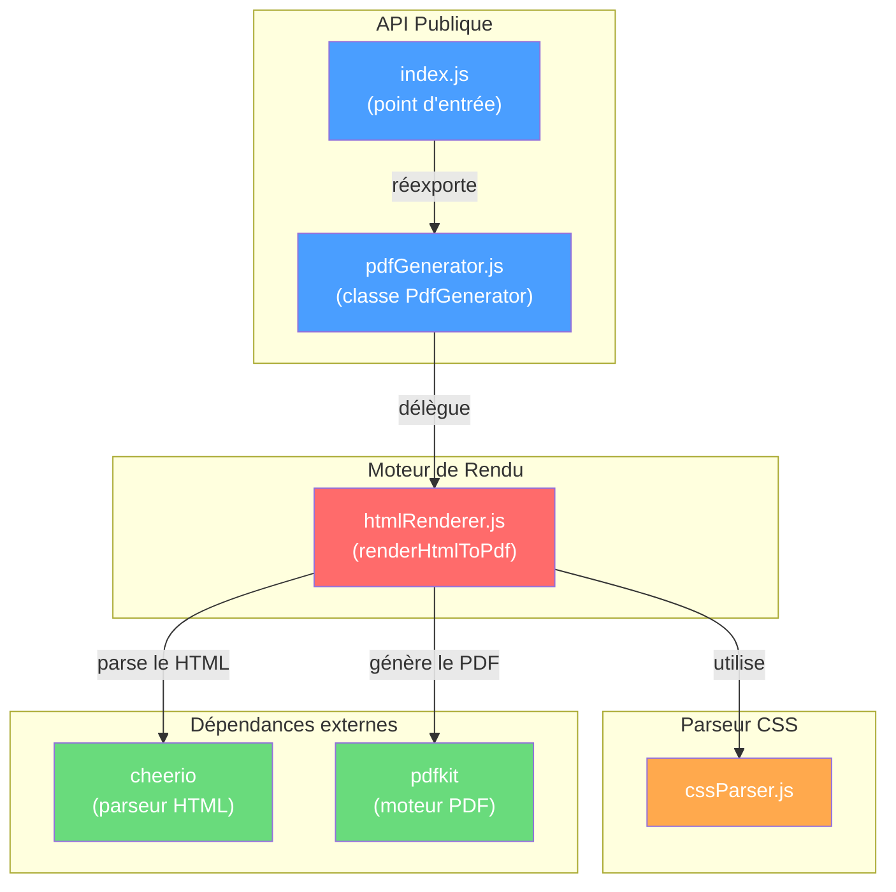
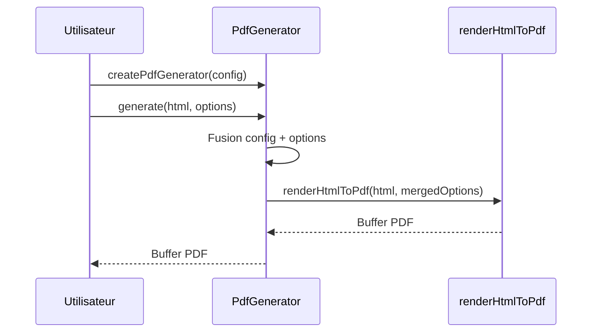
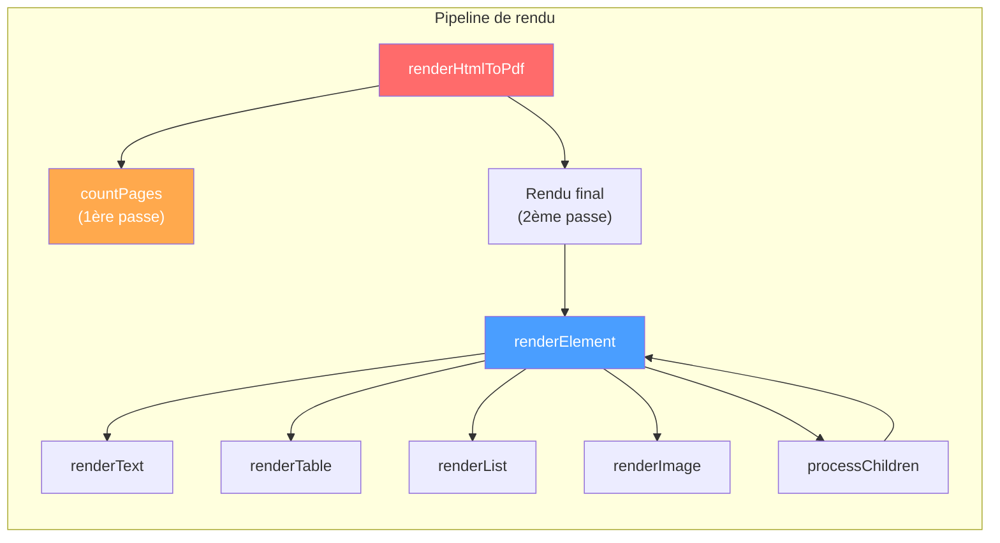
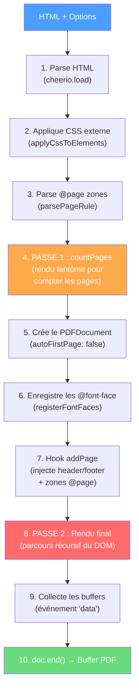
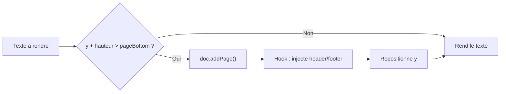
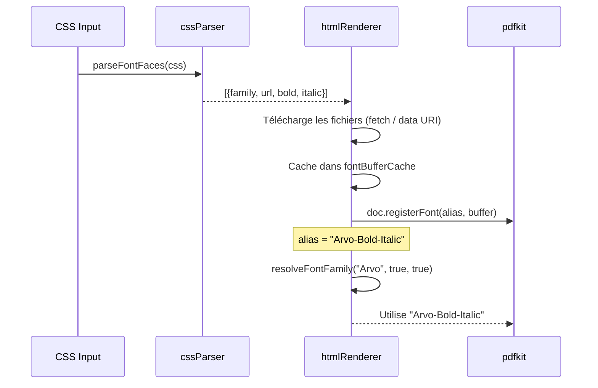
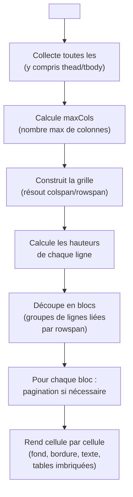

# 📄 Architecture du projet `html-to-pdf-lite-module`

## Vue d'ensemble

Ce projet est un **moteur minimal de conversion HTML → PDF** en Node.js, sans dépendance lourde (pas de navigateur headless). Il repose sur deux bibliothèques :

- **pdfkit** — moteur de rendu PDF pur JavaScript (génération bas-niveau de pages, texte, formes, images)
- **cheerio** — parseur HTML léger compatible jQuery (traversée du DOM)

Le principe : le HTML est parsé en arbre DOM via Cheerio, puis chaque nœud est parcouru récursivement pour émettre les commandes pdfkit correspondantes (texte, tableaux, images, etc.).

---

## Arborescence du projet

```
html-to-pdf-lite-module/
├── src/
│   ├── index.js            # Point d'entrée — réexporte PdfGenerator
│   ├── pdfGenerator.js     # Façade publique — API utilisateur
│   ├── cssParser.js        # Parseur CSS maison (règles, @page, @font-face)
│   └── htmlRenderer.js     # Cœur du moteur — rendu HTML → pdfkit
├── test/
│   ├── example.test.ts     # Tests unitaires Jest (44 cas)
│   ├── pdfGenerator.test.ts# Tests de la classe PdfGenerator
│   ├── manual-test.js      # Test manuel complet (génère des PDF)
│   ├── manual-test.mjs     # Test manuel ES module
│   └── fixtures/
│       └── fonts/          # Polices TTF/OTF de test
├── package.json
├── tsconfig.json
├── jest.config.js
└── README.md
```

---

## Diagramme d'architecture



---

## Les 3 modules principaux

### 1. `pdfGenerator.js` — Façade publique

> [index.js](./src/index.js) · [pdfGenerator.js](./src/pdfGenerator.js)

C'est le **point d'entrée API** du module. Il expose :

| Export | Type | Rôle |
|---|---|---|
| `PdfGenerator` | Classe | Instance configurée avec des options par défaut |
| `createPdfGenerator()` | Factory | Crée une instance de `PdfGenerator` |

**Responsabilités** :
- Stocker la configuration globale (format, orientation, marges, CSS, header/footer)
- Fusionner les options globales avec les options par appel (`generate()`)
- Déléguer le rendu à [renderHtmlToPdf](./src/htmlRenderer.js#L920-L1048)

**Flux simplifié** :



**Stratégie de fusion des options** :
- Les options passées à `generate()` **remplacent** les options globales
- Les marges sont fusionnées avec spread (`{...defaultMargin, ...configMargin, ...callMargin}`)
- Le CSS et le header/footer sont remplacés (pas concaténés)

---

### 2. `cssParser.js` — Parseur CSS maison

> [cssParser.js](./src/cssParser.js)

Un parseur CSS simplifié, implémenté avec des **regex** (pas de dépendance externe). Il gère un sous-ensemble utile de CSS.

| Fonction | Lignes | Rôle |
|---|---|---|
| [stripPageBlocks](./src/cssParser.js#L1-L24) | 1-24 | Retire les blocs `@page` du CSS pour le parsing normal |
| [stripFontFaceBlocks](./src/cssParser.js#L26-L49) | 26-49 | Retire les blocs `@font-face` du CSS |
| [parseFontFaces](./src/cssParser.js#L51-L76) | 51-76 | Extrait les déclarations `@font-face` (family, url, bold, italic) |
| [parseCssRules](./src/cssParser.js#L78-L110) | 78-110 | Parse les règles CSS en paires `{selector, properties}` |
| [elementMatchesSelector](./src/cssParser.js#L112-L146) | 112-146 | Vérifie si un élément DOM correspond à un sélecteur CSS |
| [applyCssToElements](./src/cssParser.js#L148-L201) | 148-201 | Applique les règles CSS en les injectant comme `style` inline |
| [parsePageRule](./src/cssParser.js#L227-L261) | 227-261 | Parse les zones `@page` (`@top-left`, `@bottom-center`, etc.) |

**Sélecteurs supportés** : élément (`h1`), classe (`.cls`), ID (`#id`), combiné (`div.cls`), groupé (`h1, h2`).

**Propriétés CSS supportées** : `color`, `background-color`, `font-size`, `font-weight`, `font-style`, `font-family`, `text-align`, `border`, `border-color`, `border-width`, `padding`.

> [!IMPORTANT]
> Le CSS externe est **injecté comme styles inline** sur les éléments DOM avant le rendu. Cela signifie que les styles inline écrits par l'utilisateur ont toujours **priorité** sur le CSS externe (ils sont concaténés après).

---

### 3. `htmlRenderer.js` — Cœur du moteur de rendu

> [htmlRenderer.js](./src/htmlRenderer.js)

C'est le fichier le plus volumineux (~1048 lignes). Il contient toute la logique de conversion DOM → commandes pdfkit.

#### Constantes et configuration

| Constante | Rôle |
|---|---|
| [DEFAULT_STYLE](./src/htmlRenderer.js#L7-L13) | Style par défaut (couleur noire, 12px, Helvetica) |
| [FONT_SIZES](./src/htmlRenderer.js#L15-L29) | Tailles de police par balise (`h1`=32, `h2`=28, ..., `p`=12) |
| [BLOCK_ELEMENTS](./src/htmlRenderer.js#L31-L35) | Set des éléments block (`h1-h6`, `p`, `div`, `table`, etc.) |

#### Fonctions clés



| Fonction | Lignes | Rôle |
|---|---|---|
| [parseInlineStyle](./src/htmlRenderer.js#L37-L88) | 37-88 | Parse l'attribut `style="..."` d'un élément HTML |
| [registerFontFaces](./src/htmlRenderer.js#L92-L139) | 92-139 | Télécharge et enregistre les polices `@font-face` dans pdfkit |
| [resolveFontFamily](./src/htmlRenderer.js#L141-L163) | 141-163 | Résout le nom de police (avec suffixes Bold/Italic) |
| [measureTextHeight](./src/htmlRenderer.js#L165-L171) | 165-171 | Mesure la hauteur d'un texte pour un largeur donnée |
| [renderText](./src/htmlRenderer.js#L173-L208) | 173-208 | Rend du texte avec gestion de la pagination automatique |
| [loadImage](./src/htmlRenderer.js#L220-L240) | 220-240 | Charge une image (fichier local, data URI, URL HTTP) |
| [renderImage](./src/htmlRenderer.js#L242-L304) | 242-304 | Rend une image avec redimensionnement et pagination |
| [renderList](./src/htmlRenderer.js#L317-L413) | 317-413 | Rend les listes `<ul>`/`<ol>` avec indentation et numérotation |
| [renderTable](./src/htmlRenderer.js#L447-L718) | 447-718 | Rend les tableaux avec colspan, rowspan, bordures, imbrication |
| [renderElement](./src/htmlRenderer.js#L720-L767) | 720-767 | Dispatch principal — route vers le bon renderer selon la balise |
| [countPages](./src/htmlRenderer.js#L866-L918) | 866-918 | 1ère passe : compte le nombre total de pages |
| [renderHtmlToPdf](./src/htmlRenderer.js#L920-L1048) | 920-1048 | Point d'entrée du rendu — orchestre le pipeline complet |

---

## Pipeline de rendu complet

Le rendu s'effectue en **2 passes** :



> [!NOTE]
> La **passe 1** (`countPages`) est nécessaire car les zones `@page` affichent `counter(num-pages)` — le nombre total de pages. Il faut donc d'abord simuler le rendu pour connaître ce total, puis effectuer le rendu réel.

### Détail de la passe 2 — Rendu récursif

Pour chaque nœud de l'arbre DOM :

1. **`renderElement`** identifie la balise et dispatch :
   - `<br>` → saut de ligne
   - `` → `renderImage` (chargement async + redimensionnement)
   - `<table>` → `renderTable` (grille complexe avec colspan/rowspan)
   - `<ul>` / `<ol>` → `renderList` (récursif pour l'imbrication)
   - Autres blocs → `processChildren` (récursion sur les enfants)

2. **`renderText`** gère la pagination automatique :
   - Mesure la hauteur du texte
   - Si le texte dépasse la zone de contenu → `doc.addPage()`
   - Le hook `addPage` injecte automatiquement header/footer/zones `@page`

### Gestion de la pagination



La zone de contenu est calculée ainsi :
```
pageBottom = page.height - margin.bottom - footerHeight
contentStart = margin.top + headerHeight
contentWidth = page.width - margin.left - margin.right
```

---

## Gestion des polices `@font-face`



**Système d'alias** :
- Chaque variante est enregistrée avec un suffixe : `Family`, `Family-Bold`, `Family-Italic`, `Family-Bold-Italic`
- `resolveFontFamily()` construit le nom d'alias en fonction du contexte (bold/italic en cours)
- Fallback : si l'alias exact n'existe pas, utilise la variante la plus proche

**Cache** : Un `Map` (`fontBufferCache`) est partagé entre les 2 passes pour éviter de retélécharger les polices.

---

## Gestion des tableaux

Le rendu des tableaux est la partie la plus complexe (~270 lignes). Voici la stratégie :



> [!TIP]
> Les tableaux imbriqués (jusqu'à 5 niveaux) fonctionnent par récursion : quand une cellule contient un `<table>`, `renderElement` est appelé récursivement avec le contexte (position x/y) de la cellule parente.

---

## Zones `@page`

6 zones sont supportées, disposées ainsi :

```
┌──────────────────────────────────────────┐
│  @top-left    @top-center    @top-right  │
│──────────────────────────────────────────│
│                                          │
│              Zone de contenu             │
│                                          │
│──────────────────────────────────────────│
│  @bottom-left @bottom-center @bottom-right│
└──────────────────────────────────────────┘
```

- Les zones sont définies dans une règle `@page { ... }` du CSS
- Les compteurs `counter(page)` et `counter(num-pages)` sont résolus dynamiquement
- Si des zones `@page` sont présentes, elles **remplacent** les options `header`/`footer`

---

## Dépendances

| Dépendance | Version | Rôle |
|---|---|---|
| `pdfkit` | ^0.15.0 | Génération PDF bas-niveau (texte, images, formes, pages) |
| `cheerio` | ^1.0.0 | Parseur HTML → DOM traversable (API jQuery) |

> [!NOTE]
> Aucune dépendance sur un navigateur headless (Puppeteer, Playwright) — le module est **léger et autonome**, idéal pour les environnements serveur ou serverless.

**Dépendances de développement** (implicites via tsconfig/jest) :
- `ts-jest` — Transpilation TypeScript pour les tests
- `jest` — Framework de test

---

## Tests

Le projet utilise **Jest** avec `ts-jest` (preset ESM). Les tests sont écrits en TypeScript.

| Fichier | Contenu |
|---|---|
| [example.test.ts](./test/example.test.ts) | 44 tests couvrant tous les cas : headings, CSS, tableaux, listes, images, @page, @font-face |
| [pdfGenerator.test.ts](./test/pdfGenerator.test.ts) | Tests de la classe `PdfGenerator` et de la factory |
| [manual-test.js](./test/manual-test.js) | Test manuel — génère des fichiers PDF pour vérification visuelle |

**Couverture des tests** :
- Balises HTML (`h1-h6`, `p`, `div`, `span`, `br`, `a`)
- CSS inline et externe
- Tableaux (simple, thead/tbody, bordures, colspan, rowspan, imbriqués)
- Listes (ul, ol, imbriquées, avec styles)
- Images (fichier, dimensions, data URI, overflow, URL)
- En-tête/pied de page (global, par appel, multi-pages)
- Zones `@page` (6 zones, compteurs)
- Polices `@font-face` (URL, data URI, variantes)
- Pagination automatique

---

## Résumé des patterns architecturaux

| Pattern | Utilisation |
|---|---|
| **Façade** | `PdfGenerator` expose une API simple, cache la complexité du rendu |
| **Factory** | `createPdfGenerator()` crée des instances configurées |
| **Visitor/Recursive Descent** | `renderElement` → dispatch récursif sur chaque nœud du DOM |
| **Two-Pass Rendering** | 1ère passe pour compter les pages, 2ème pour le rendu final |
| **Hook/Monkey-Patching** | `doc.addPage` est surchargé pour injecter header/footer à chaque page |
| **Cache** | `fontBufferCache` évite les téléchargements de polices redondants |

---

## Limitations actuelles et pistes d'évolution

> Documentées dans le [README](./README.md#L299-L304)

- **CSS avancé** : pas de `line-height`, `letter-spacing`, `text-decoration`, `margin`
- **Pas de media queries**
- **Pas de layout CSS** : `float`, `display: flex/grid`, `position`
- **Éléments manquants** : `<hr>`, `<blockquote>`, `<pre>`, `<code>`
- **Sélecteurs CSS limités** : pas de sélecteurs descendants (`div p`), pseudo-classes (`:first-child`), ou sélecteurs d'attributs (`[href]`)
