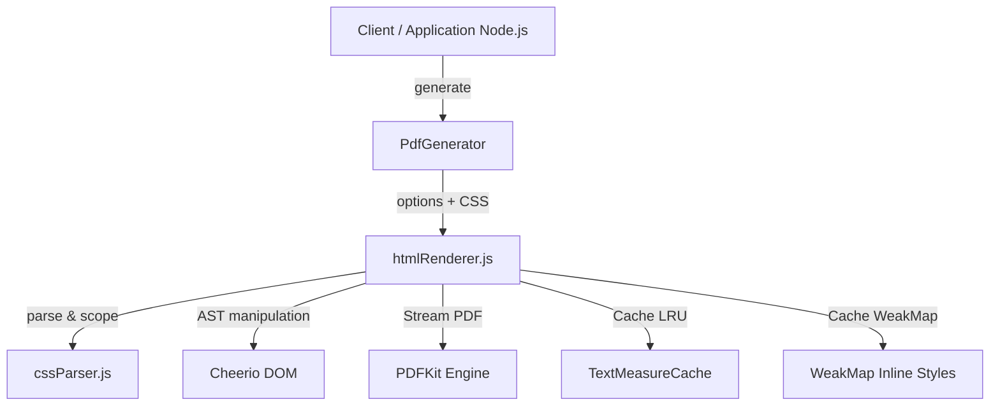
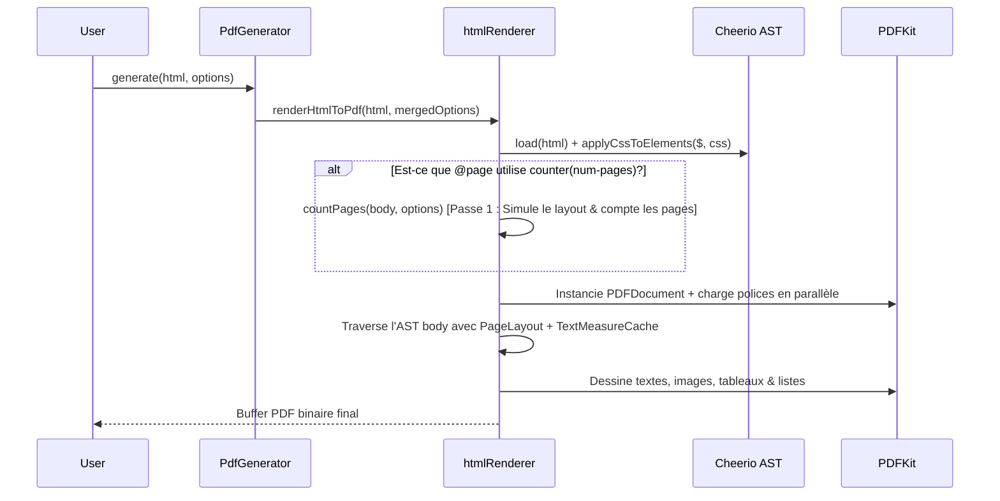

# Architecture Technique — `html-to-pdf-lite-module`

## 📐 Vue d'Ensemble

`html-to-pdf-lite-module` est un moteur léger de conversion HTML + CSS vers PDF sous Node.js.  
Il offre un compromis optimal entre vitesse de rendu, faible empreinte mémoire et fidélité de mise en page sans dépendre de Navigateurs Headless lourds (Puppeteer/Playwright).

---

## 🧱 Diagramme de Composants

---

## ⚙️ Modules Principaux

### 1. `pdfGenerator.js` (Façade & Factory)
- Expose l'API publique via `createPdfGenerator(config)`.
- Gère la fusion d'options globales (format, orientation, marges, CSS par défaut, header/footer) avec les options par appel.
- Implémente le pattern Factory sans mutation d'état global.

### 2. `cssParser.js` (Moteur d'analyse CSS)
- **Regex pré-compilées au chargement du module** pour supprimer tout surcoût de compilation à l'exécution.
- Gère le stripping des blocs `@font-face` et `@page` pour la résolution des sélecteurs d'éléments.
- Injection optimisée des styles CSS (`applyCssToElements`) avec sérialisation unique par règle.
- Extraction optimisée des blocs `@page` et des 6 zones de mise en page (`@top-left`, `@top-center`, `@top-right`, `@bottom-left`, `@bottom-center`, `@bottom-right`).

### 3. `htmlRenderer.js` (Moteur de Rendu PDF & Layout)
- **Shared DOM AST** : Le document HTML est parsé une seule fois par Cheerio.
- **Conditional Two-Pass Pipeline** :
  - **Single-Pass (1 passe)** : Déclenché par défaut lorsque les règles `@page` n'utilisent pas `counter(num-pages)`.
  - **Two-Pass (2 passes)** : Déclenché uniquement si `counter(num-pages)` est présent dans les règles CSS. Le DOM et le cache d'images sont réutilisés entre la passe de comptage (`countPages`) et la passe de rendu final.
- **`PageLayout`** : Helper pré-calculant les géométries de page, marges et zones actives une seule fois.
- **`TextMeasureCache`** : Cache LRU (512 entrées) évitant les recalculs de hauteurs de glyphes (`doc.heightOfString()`).
- **`WeakMap` Inline Style Cache** : Cache la conversion des attributs `style="..."` pour les éléments du DOM sans surcoût mémoire.
- **Chargement Parallèle** : Les polices distantes (`@font-face`) et images externes sont chargées en parallèle (`Promise.all`).

---

## 🔄 Pipeline de Rendu Detailed

---

## 🎨 Polices & Injection `@page`

- **Polices TTF/OTF** : Support des polices distantes (HTTP), locales (disque) et Data URIs (`base64`). Injection dynamique dans PDFKit via `doc.registerFont()`.
- **Règles `@page`** : Rendu dynamique des en-têtes et pieds de page sur les 6 zones CSS avec substitution automatique des compteurs `counter(page)` et `counter(num-pages)`.
