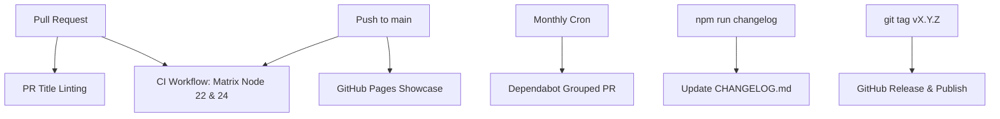

# CI/CD, Dependabot & Semantic Versioning Documentation

This document describes the Continuous Integration (CI), Continuous Deployment (CD), automated dependency management (Dependabot), and Semantic Versioning (SemVer) release pipeline implemented for `html-to-pdf-lite-module`.

---

## 📌 Overview

The module uses GitHub Actions workflows to automate code validation, dependency updates, pull request title enforcement, release management, and documentation deployment:



---

## 🛠️ GitHub Actions Workflows

| Workflow | File Path | Trigger | Purpose |
| :--- | :--- | :--- | :--- |
| **Continuous Integration** | `.github/workflows/ci.yml` | `push` (main), `pull_request` | Matrix test on Node 22 & 24: format check, typecheck, lint, build, integration tests & unit coverage. |
| **PR Title Validator** | `.github/workflows/semantic-pr-title.yml` | `pull_request_target` | Validates PR title adheres to Conventional Commits. |
| **GitHub Pages** | `.github/workflows/deploy-pages.yml` | `push` (main), `workflow_dispatch` | Builds module, verifies tests, audits fidelity, and deploys demo showcase to GitHub Pages. |

---

## 📦 Dependabot Configuration

Dependabot automates dependency updates on a **monthly schedule**:

- **Configuration File**: `.github/dependabot.yml`
- **Schedule**: First Monday of every month at 06:00 (Europe/Paris).
- **Package Ecosystems**:
  - `npm`: Updates Node.js dependencies (`dependencies` and `devDependencies`).
  - `github-actions`: Updates GitHub Action versions.
- **Grouped PRs**: Dependencies are grouped into single pull requests (`dependencies`, `devDependencies`, `actions`) to minimize PR noise.
- **Commit Prefixes**:
  - Production dependencies: `build(deps)`
  - Dev dependencies: `build(deps-dev)`
  - GitHub Actions: `ci(deps)`

---

## 🏷️ Semantic Versioning (SemVer 2.0.0) & Conventional Commits

This project follows **Semantic Versioning 2.0.0** (`MAJOR.MINOR.PATCH`):

- **MAJOR**: Breaking API changes (`feat!: ...` or `BREAKING CHANGE: ...` in footer).
- **MINOR**: Backward-compatible new functionality (`feat: ...`).
- **PATCH**: Backward-compatible bug fixes (`fix: ...` or `perf: ...`).

### Enforcing Conventional Commits

- **Local Validation**: Developers can run `npm run commitlint` to validate commit messages locally using `@commitlint/cli` and `@commitlint/config-conventional`.
- **CI Validation**: Pull Request titles are checked via `amannn/action-semantic-pull-request`.

---

## 📖 Manual Changelog Generation (`npm run changelog`)

To provide full developer control and prevent automated GitHub Actions from generating conflicting or messy release PRs, changelog updates can be generated locally and on-demand using the dedicated script:

```bash
# Preview upcoming changes without modifying files (dry run)
npm run changelog:check

# Generate / update CHANGELOG.md with commits since the latest git tag
npm run changelog

# Target a specific release version (e.g. 2.4.0)
npm run changelog -- --version 2.4.0

# Generate an [Unreleased] section for pending commits
npm run changelog -- --unreleased

# Regenerate sections across all git tags
npm run changelog:all
```

### Supported CLI Flags

| Flag | Description | Default |
| :--- | :--- | :--- |
| `-d`, `--dry-run` | Preview changelog in terminal without touching `CHANGELOG.md` | `false` |
| `-v`, `--version <ver>` | Specify the target release version | `package.json` version |
| `-u`, `--unreleased` | Target `[Unreleased]` section | `false` |
| `--from <tag>` | Start git ref or tag | Latest tag (`git tag -l`) |
| `--to <ref>` | End git ref | `HEAD` |
| `--date <YYYY-MM-DD>` | Release date in version header | Today's date |
| `--force` | Overwrite existing section for the specified version | `false` |
| `--append` | Append new entries to existing section | `false` |
| `-a`, `--all` | Regenerate changelog across all tags in descending order | `false` |
| `-h`, `--help` | Display usage instructions | - |

### How It Works

1. **Commit Parsing**: Inspects `git log` and parses Conventional Commits (`feat`, `fix`, `perf`, `refactor`, `docs`, `test`, `build`, `ci`, `chore`, and `!`/`BREAKING CHANGE`).
2. **Categorization**: Groups commits into cleanly formatted sections with visual icons (`🚀 Features`, `🐛 Bug Fixes`, `⚡ Performance Improvements`, etc.).
3. **Links**: Automatically generates clickable markdown links for PR references (`#15`) and commit hashes to the GitHub repository.
4. **Safety & Preservation**: Existing curated notes (such as detailed French showcases or hand-written release highlights) are strictly preserved unless `--force` is explicitly provided.

---

## 🏷️ Release & Publishing Workflow

Releases are managed directly and reliably through standard git commands and the changelog utility:

1. **Changelog Generation**: Run `npm run changelog` to aggregate commits since the last release tag into `CHANGELOG.md`.
2. **Version Bump**: Update `version` in `package.json` following SemVer.
3. **Commit & Tag**:
   ```bash
   git commit -am "chore(release): v2.5.0"
   git tag v2.5.0
   git push origin main --tags
   ```
4. **Publish**: Run `npm publish` (runs `prepublishOnly` which automatically enforces `npm run typecheck && npm run build`).
