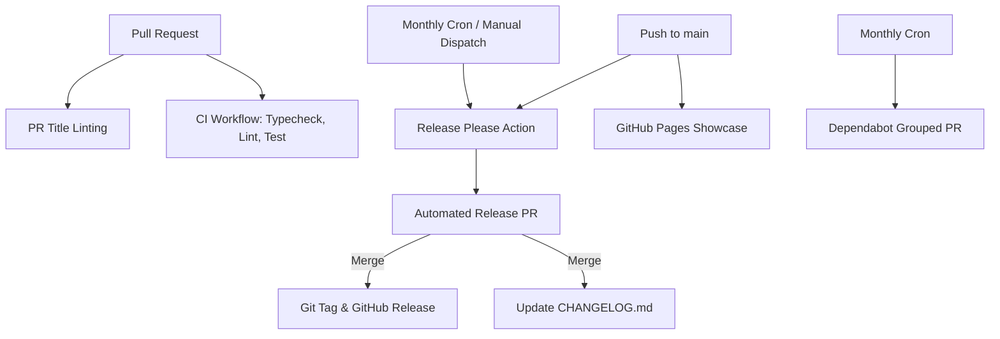

# CI/CD, Dependabot & Semantic Versioning Documentation

This document describes the Continuous Integration (CI), Continuous Deployment (CD), automated dependency management (Dependabot), and Semantic Versioning (SemVer) release pipeline implemented for `html-to-pdf-lite-module`.

---

## 📌 Overview

The module uses GitHub Actions workflows to automate code validation, dependency updates, pull request title enforcement, release management, and documentation deployment:

---

## 🛠️ GitHub Actions Workflows

| Workflow | File Path | Trigger | Purpose |
| :--- | :--- | :--- | :--- |
| **Continuous Integration** | `.github/workflows/ci.yml` | `push` (main), `pull_request` | Runs TypeScript typecheck, oxlint, and unit/integration tests. |
| **PR Title Validator** | `.github/workflows/semantic-pr-title.yml` | `pull_request_target` | Validates PR title adheres to Conventional Commits. |
| **Release & Changelog** | `.github/workflows/release.yml` | `push` (main), `schedule` (monthly), `workflow_dispatch` | Runs Release Please to update `CHANGELOG.md` and manage release PRs. |
| **GitHub Pages** | `.github/workflows/deploy-pages.yml` | `push` (main), `workflow_dispatch` | Builds and deploys demo showcase to GitHub Pages. |

---

## 📦 Dependabot Configuration

Dependabot automates dependency updates on a **monthly schedule**:

- **Configuration File**: `.github/dependabot.yml`
- **Schedule**: First Monday of every month at 06:00 (Europe/Paris).
- **Package Ecosystems**:
  - `npm`: Updates Node.js dependencies (`dependencies` and `devDependencies`).
  - `github-actions`: Updates GitHub Action versions.
- **Grouped PRs**: Dependencies are grouped into single pull requests (`dependencies`, `devDependencies`, `actions`) to minimize PR noise.
- **Commit Prefixes**:
  - Production dependencies: `build(deps)`
  - Dev dependencies: `build(deps-dev)`
  - GitHub Actions: `ci(deps)`

---

## 🏷️ Semantic Versioning (SemVer 2.0.0) & Conventional Commits

This project follows **Semantic Versioning 2.0.0** (`MAJOR.MINOR.PATCH`):

- **MAJOR**: Breaking API changes (`feat!: ...` or `BREAKING CHANGE: ...` in footer).
- **MINOR**: Backward-compatible new functionality (`feat: ...`).
- **PATCH**: Backward-compatible bug fixes (`fix: ...` or `perf: ...`).

### Enforcing Conventional Commits

- **Local Validation**: Developers can run `npm run commitlint` to validate commit messages locally using `@commitlint/cli` and `@commitlint/config-conventional`.
- **CI Validation**: Pull Request titles are checked via `amannn/action-semantic-pull-request`.

---

## 📄 Automated Changelog & Release Management

We use **Release Please** (`googleapis/release-please-action`):

1. **Configuration**: Managed via `release-please-config.json` and `.release-please-manifest.json`.
2. **Release PR**: On commits to `main` (or when triggered manually / monthly), Release Please maintains a draft **Release PR**.
3. **Changelog**: The Release PR automatically compiles commit logs into [CHANGELOG.md](file:///d:/Code/html-to-pdf-lite-module/CHANGELOG.md) formatted by section (`Features`, `Bug Fixes`, `Performance Improvements`, etc.).
4. **Publishing a Release**: Merging the Release PR automatically creates the git tag (e.g. `v2.1.0`), creates a GitHub Release, and updates package versions.

### Triggering a Release Manually

Maintainers can manually trigger release preparation at any time:
1. Go to the **Actions** tab on GitHub.
2. Select the **Release & Changelog** workflow.
3. Click **Run workflow** and select the `main` branch.
